# Repair Shop Management System (LabRepair)

## Назва
**LabRepair** — CRM система для сервісних центрів та майстерень з ремонту техніки.

## УРЛ
**Live URL:** [https://repair-shop-client.vercel.app](https://repair-shop-client.vercel.app)

## Функції
Система забезпечує повний цикл управління сервісним центром:
- **Управління замовленнями:** Створення, відстеження статусів (від "Прийнято" до "Видано"), призначення майстрів.
- **База клієнтів та пристроїв:** Збереження історії ремонтів кожного клієнта, облік пристроїв (бренд, модель, серійний номер).
- **Складський облік (Інвентар):** Управління запасами деталей, послуг та аксесуарів, контроль залишків (stock_quantity).
- **Фінансовий облік:** Фіксація оплат (готівка, картка тощо), автоматичний розрахунок статусів оплати ("Частково", "Оплачено"), перегляд транзакцій.
- **Рольова система доступу:** Розмежування прав між Адміністратором, Працівником (Майстром) та Клієнтом.

## Авторизація
**Сторінка авторизації:** [https://repair-shop-client.vercel.app/login](https://repair-shop-client.vercel.app/login) (або `/login`)
**Сторінка реєстрації (для клієнтів):** `/register`

Система використовує JWT токени (Access та Refresh) для захисту сесій.

### Ролі та доступ:
1. **Admin (Адміністратор):** Має повний доступ до всіх функцій, включаючи фінанси, видалення замовлень та управління командою (створення працівників).
   - **Логін:** `admin@repair.shop`
   - **Пароль:** `admin123`

2. **Employee (Працівник/Майстер):** Може створювати та редагувати замовлення, переглядати інвентар, базу клієнтів та пристроїв, але не має доступу до загальних фінансів та налаштувань команди.
   - **Логін:** `master@repair.shop` (або `master3@repair.shop` або `master2@repair.shop`)
   - **Пароль:** `master123`
   - *Примітка:* Нові облікові записи майстрів створює Адміністратор у панелі `/team`.

3. **Client (Клієнт):** Може переглядати лише власні замовлення на ремонт та їх статус.
   - **Логін:** `client@test.com` (тестовий клієнт з бази)
   - **Пароль:** `client123`
   - *Примітка:* Клієнт також може створити свій обліковий запис самостійно на сторінці `/register`.

---

## Сторінки проекту

### 1. Головна сторінка (Landing Page)
- **УРЛ:** `/`
- **Опис:** Публічна сторінка, яка презентує сервіс. Містить публічний пошук замовлення за номером квитанції або номером телефону.
- **Скріншот:**
  

### 2. Авторизація / Реєстрація
- **УРЛ:** `/login` та `/register`
- **Опис:** Форми для входу в систему та реєстрації нових клієнтів.
- **Скріншот:**
  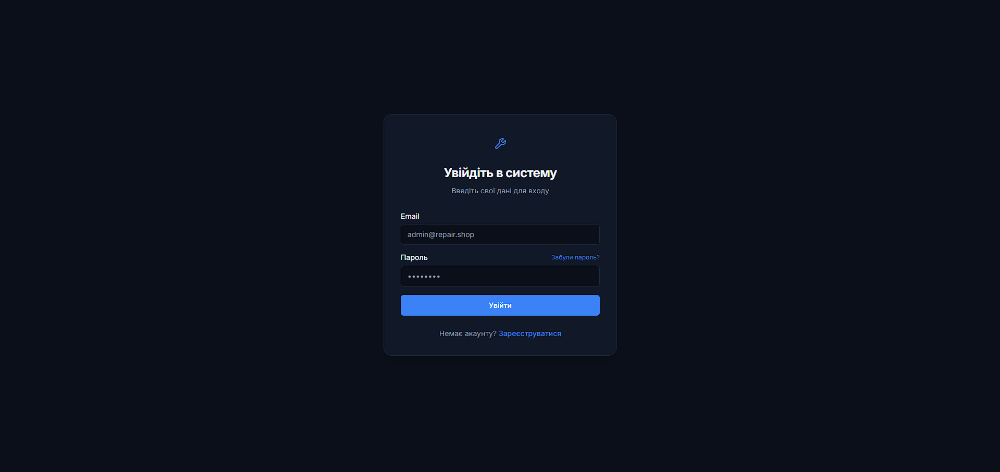

### 3. Дашборд (Dashboard)
- **УРЛ:** `/dashboard`
- **Опис:** Аналітична панель для адміністраторів та працівників. Відображає ключові показники (нові замовлення, виручка, активні ремонти) у вигляді карток та графіків.
- **Скріншот:**
  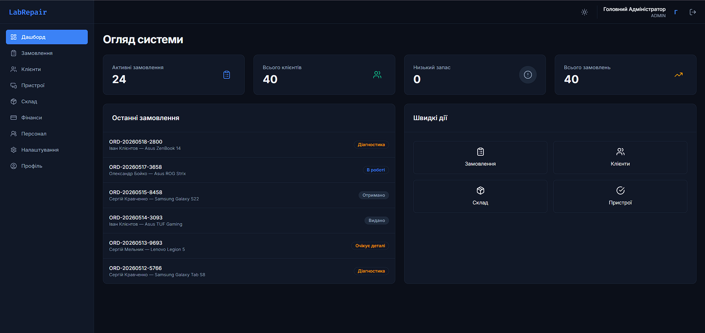

### 4. Замовлення (Orders)
- **УРЛ:** `/orders`
- **Опис:** Таблиця зі списком усіх ремонтів. Дозволяє фільтрувати замовлення, змінювати статуси та створювати нові заявки.
- **Скріншот:**
  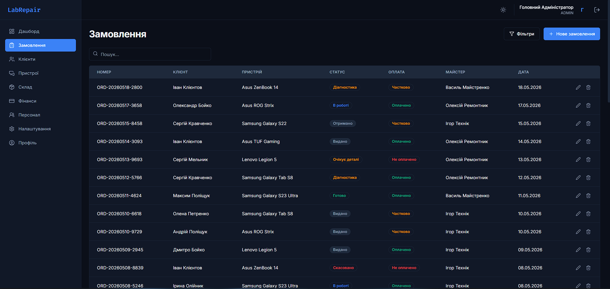

### 5. Деталі замовлення (Order Details)
- **УРЛ:** `/orders/:id` (наприклад, `/orders/123...`)
- **Опис:** Детальна картка конкретного ремонту. Тут можна додавати виконані роботи/запчастини, проводити оплату, роздруковувати квитанцію та призначати майстра.
- **Скріншот:**
  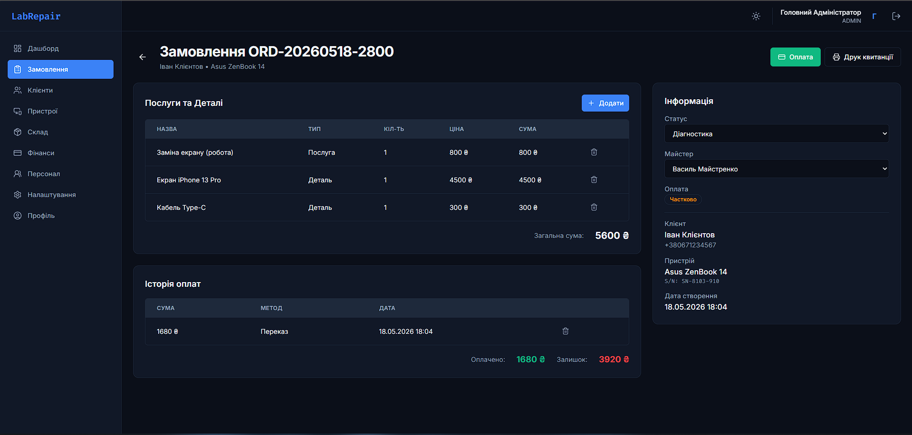

### 6. Клієнти (Clients)
- **УРЛ:** `/clients`
- **Опис:** База даних усіх клієнтів сервісного центру з їх контактними даними.
- **Скріншот:**
  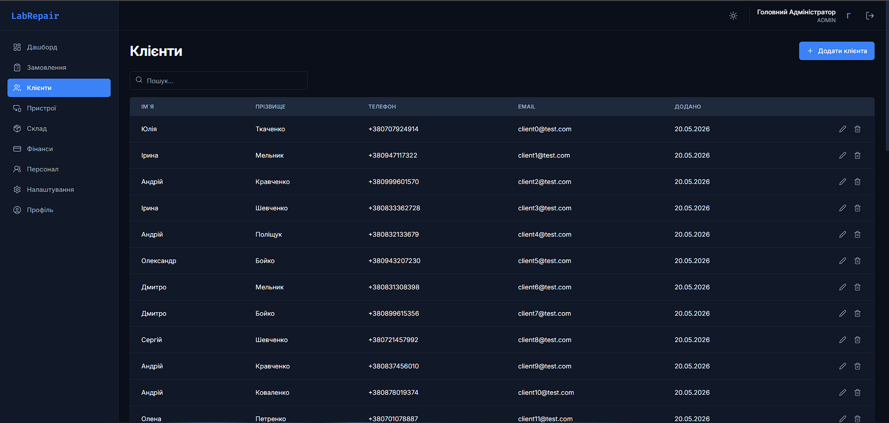

### 7. Пристрої (Devices)
- **УРЛ:** `/devices`
- **Опис:** Список зареєстрованої техніки. Дозволяє прив'язувати пристрої до клієнтів та додавати фотографії стану.
- **Скріншот:**
  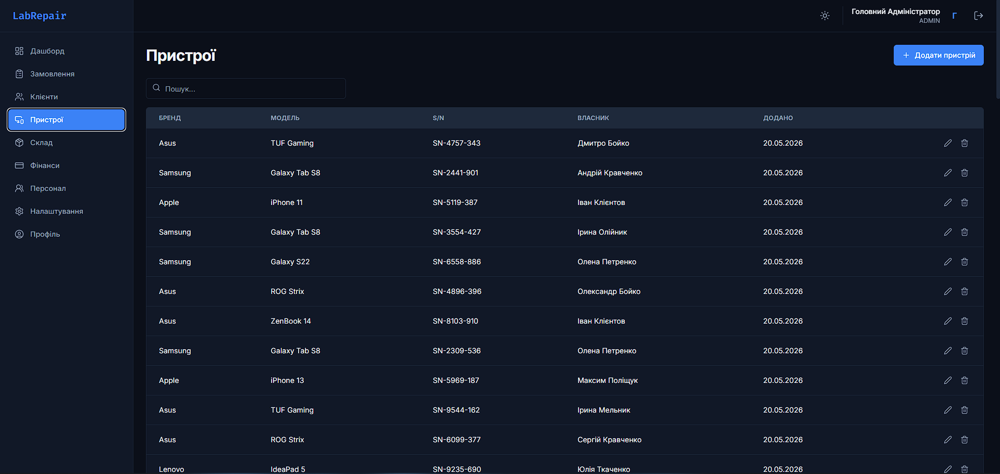

### 8. Склад (Inventory)
- **УРЛ:** `/inventory`
- **Опис:** Облік товарів та запчастин. Дозволяє контролювати залишки, ціни та додавати нові позиції на склад.
- **Скріншот:**
  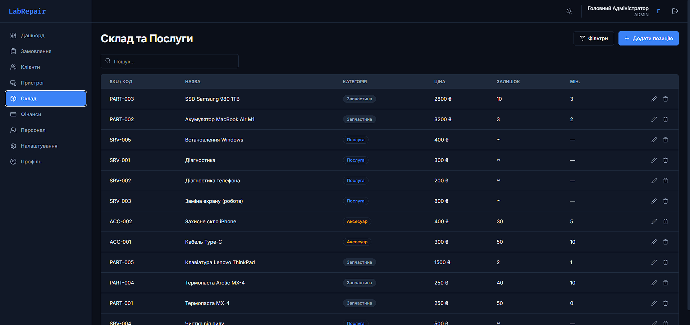

### 9. Фінанси (Finance)
- **УРЛ:** `/finance`
- **Опис:** (Тільки для Admin). Сторінка для відстеження всіх фінансових транзакцій, доходів та витрат сервісного центру.
- **Скріншот:**
  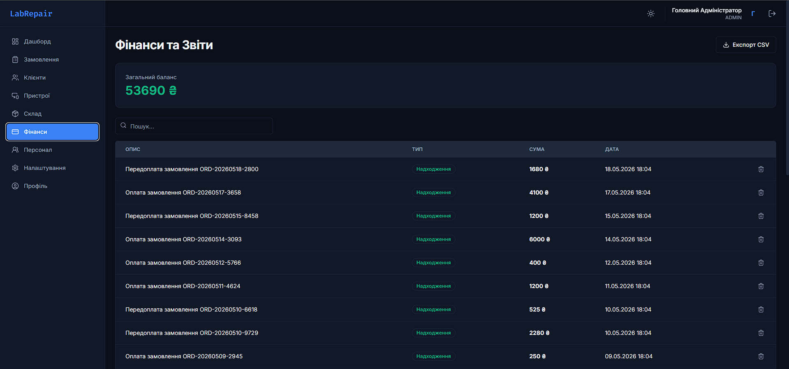

### 10. Команда (Team)
- **УРЛ:** `/team`
- **Опис:** (Тільки для Admin). Керування співробітниками: додавання нових майстрів, надання прав доступу, видалення.
- **Скріншот:**
  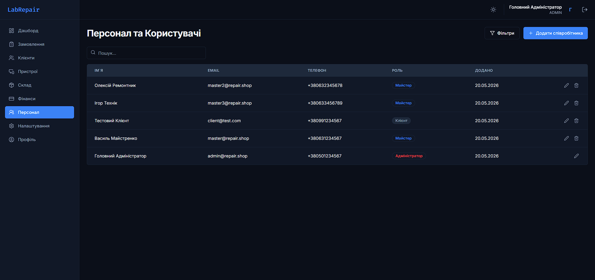

### 11. Мої замовлення (My Orders)
- **УРЛ:** `/my-orders`
- **Опис:** (Тільки для Client). Особистий кабінет клієнта, де він бачить статус ремонту лише своїх пристроїв.
- **Скріншот:**
  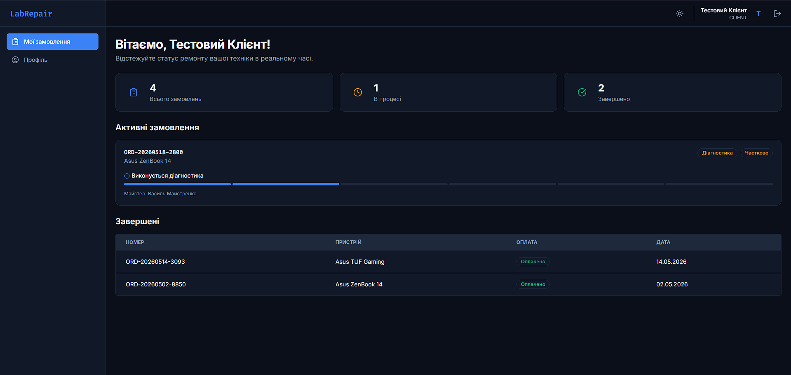

### 12. Профіль (Profile)
- **УРЛ:** `/profile`
- **Опис:** Сторінка налаштувань власного профілю (ім'я, телефон) для будь-якого авторизованого користувача.
- **Скріншот:**
  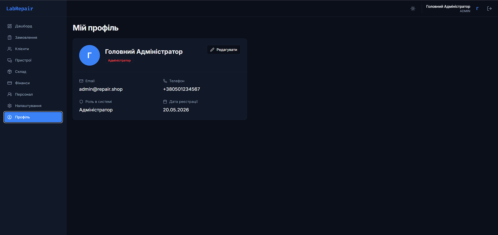
